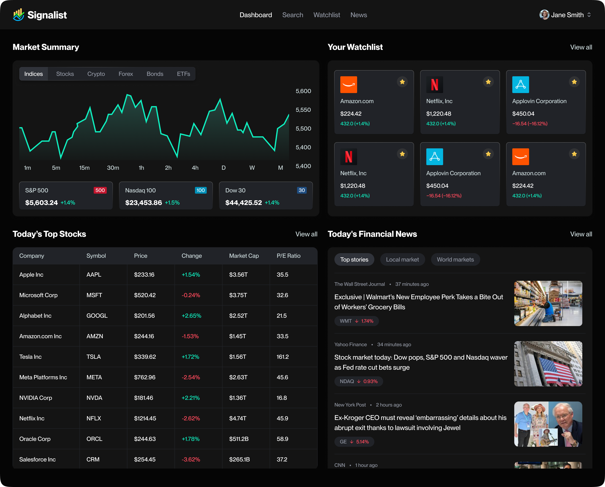

# TradeVerse 📈



**TradeVerse** is a comprehensive FinTech dashboard and stock analysis platform built with **Next.js 16**. It provides real-time market data, interactive charts, portfolio tracking, and personalized AI-driven market insights sent directly to users' inboxes.

## 🚀 Features

* **Real-Time Dashboard**: Interactive market overview, stock heatmaps, and top stories powered by TradingView widgets.
* **Advanced Stock Analysis**: Detailed candlestick charts, technical analysis indicators, and company financials for thousands of tickers.
* **Smart Search**: Fast, debounced stock search functionality powered by the Finnhub API.
* **Secure Authentication**: Full email/password authentication flow using **Better Auth**.
* **Personalized Watchlist**: Users can save stocks to their profile to track performance over time (stored in MongoDB).
* **AI-Powered Insights**:
    * **Welcome Emails**: Personalized onboarding emails generated by **Google Gemini AI** based on user investment goals.
    * **Daily News**: AI-summarized market news delivered via email using **Inngest** workflows.
* **Responsive Design**: Fully responsive UI built with Tailwind CSS and Shadcn UI components.

## 🛠️ Tech Stack

**Frontend:**
* **Framework:** Next.js 16 (App Router)
* **Language:** TypeScript
* **Styling:** Tailwind CSS, Tailwind Animate
* **Components:** Shadcn UI, Lucide React
* **Forms:** React Hook Form, Zod
* **Visualization:** TradingView Widgets

**Backend & Data:**
* **Database:** MongoDB (via Mongoose)
* **Auth:** Better Auth (with MongoDB adapter)
* **Market Data API:** Finnhub.io
* **Background Jobs:** Inngest (Serverless Queues)
* **AI Model:** Google Gemini (via Inngest)
* **Email:** Nodemailer (SMTP)

## ⚙️ Environment Variables

To run this project, you will need to add the following environment variables to your `.env` file:

```env
# Database
MONGODB_URI=your_mongodb_connection_string

# Authentication (Better Auth)
BETTER_AUTH_SECRET=your_generated_secret_key
BETTER_AUTH_URL=http://localhost:3000

# Market Data
NEXT_PUBLIC_FINNHUB_API_KEY=your_finnhub_api_key
FINNHUB_API_KEY=your_finnhub_api_key

# AI & Background Jobs
GEMINI_API_KEY=your_google_gemini_api_key

# Email Service (Nodemailer/Gmail)
NODEMAILER_EMAIL=your_email_address
NODEMAILER_PASSWORD=your_app_specific_password
```
🏁 Getting Started
Clone the repository:

```git clone [https://github.com/your-username/tradeverse.git](https://github.com/your-username/tradeverse.git)
cd tradeverse
```
Install dependencies:
```
npm install
# or
pnpm install
```
Run the development server:
```
npm run dev
```
Open the app: Visit http://localhost:3000 in your browser.

⚡ Running Background Jobs (Inngest)
TradeVerse uses Inngest to handle AI email generation. To test these features locally:

Start the Inngest Dev Server (in a separate terminal):

Bash

npx inngest-cli@latest dev
Open the Inngest Dashboard: Visit http://localhost:8288 to see your functions (sign-up-email, daily-new-summary) and trigger test events.

📂 Project Structure
```
tradeverse/
├── app/                # Next.js App Router pages and layouts
│   ├── (auth)/         # Authentication routes (sign-in, sign-up)
│   ├── (root)/         # Main application routes (dashboard, stocks)
│   └── api/            # API routes (Inngest webhook)
├── components/         # Reusable UI components
│   ├── forms/          # Form-specific components
│   └── ui/             # Shadcn UI primitives
├── database/           # MongoDB models and connection logic
├── hooks/              # Custom React hooks (useDebounce, etc.)
├── lib/                # Utility functions and configurations
│   ├── actions/        # Server Actions (Finnhub, Auth, Users)
│   ├── better-auth/    # Auth configuration
│   ├── inngest/        # AI workflows and prompt engineering
│   └── nodemailer/     # Email templates and transporter
├── public/             # Static assets
└── types/              # Global TypeScript definitions
```
🤝 Contributing
Contributions are welcome! Please follow these steps:

Fork the project.

Create your feature branch (git checkout -b feature/AmazingFeature).

Commit your changes (git commit -m 'Add some AmazingFeature').

Push to the branch (git push origin feature/AmazingFeature).

Open a Pull Request.

📄 License
Distributed under the MIT License. See LICENSE for more information.

Note: This project uses Finnhub for data. Please ensure you respect their API rate limits and terms of service.
